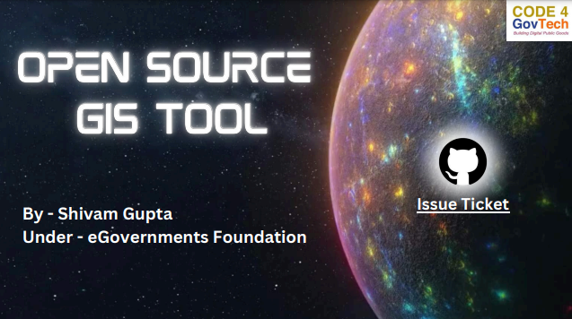

# Welcome to Open-Source GIS Tool
**A Python GIS tool for geospatial analysis and interactive mapping to solve real world issues.**

## Introduction
The **Open Source GIS Tool** aims to develop a user-friendly and accessible GIS tool to help users use geospatial information and geographic data to solve real-world problems. The tool will empower urban planners, engineers, policymakers, and community stakeholders to identify suitable locations for various projects (like sustainable water management, efficient resource distribution, goods storage, other location-based projects etc.) and design their plans accordingly. By integrating geospatial data and advanced analytical capabilities, the tool will facilitate informed decision-making, optimize resource allocation and promote community participation. Emphasizing openness, scalability, and user-centric design, the project seeks to foster collaboration, capacity building and policy influence to address real-world problems and provide an intuitive and ready-to-use GIS platform for Indian cities and abroad.

## Usage

- Clone the repository - https://github.com/SGCODEX/egov-rnd/tree/C4GT-OpenGIS-Shivam
- Navigate to Open-Source-GIS-Tool folder
- Navigate to Python_Code folder
- Run the file: gistool.ipynb
- Download / install all python libraries from requirements.txt using: pip install -r requirements.txt --quiet
- If it prompts for earth engine code, just keep on continuing and copy the code and paste it.
- Now run all cells
- A menu driven function will start, asking for your numerical choice from the following:
    1. Interactive GIS Tool with multiple feature levels for a specific ward
    2. Find shortest distance between two facilities
    3. Find area covered / serviced by a facility
    4. Find which facility serves what area in a given map
    5. EXIT 
- Input the numerical choice to the function you want to implement and enter the required inputs as asked
- Press y or n to continue after executing each function

## Key Features

## Demo

## Future Scopes
- Check: 
https://bhuvan.nrsc.gov.in/home/index.php
https://www.spacecentre.co.uk/
https://hsac.org.in/harsac/
https://www.csus.edu/administration-business-affairs/space-management/
